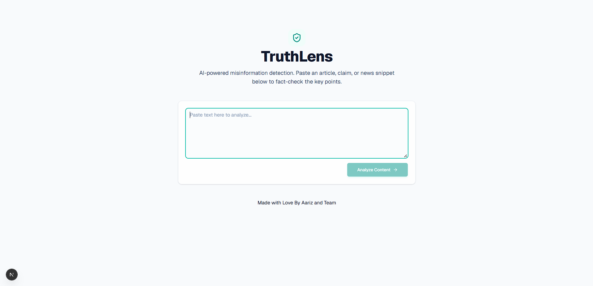
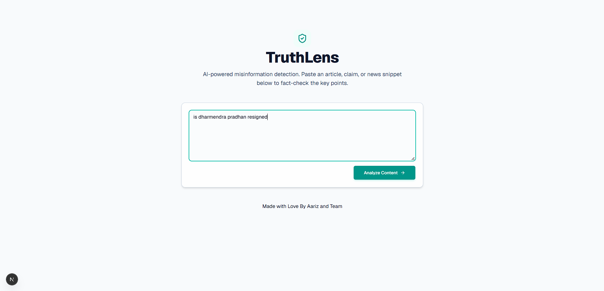
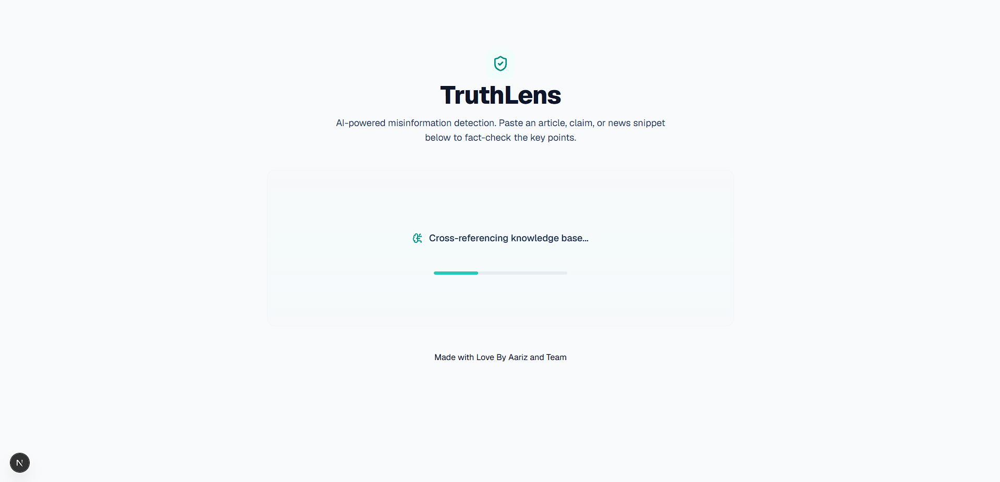
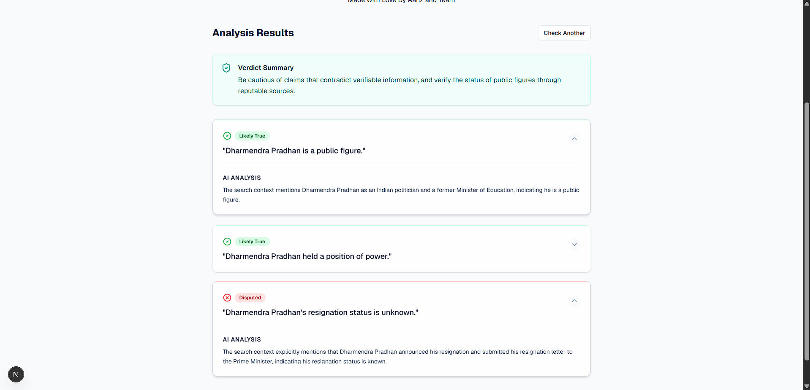
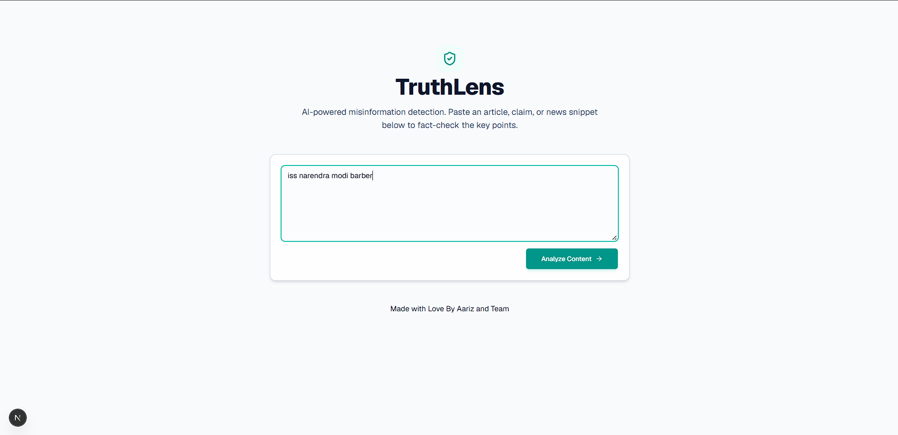
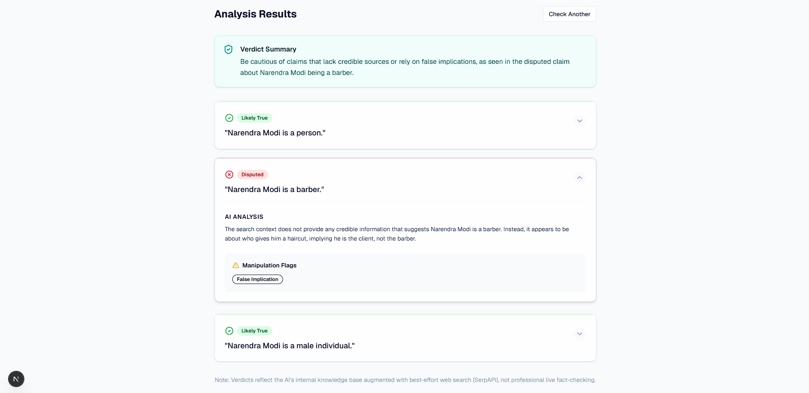

## **TruthLens**
TruthLens is a lightweight AI assistant that sits right where people consume content — as a web app for pasted text/links, and eventually a browser extension — and gives them a fast, explained verdict instead of a flat "true/false" label.

Instead of trying to be an oracle that declares content real or fake, TruthLens breaks a piece of content down the way a careful human fact-checker would: it pulls out the individual factual claims being made, checks each one against live web sources, flags manipulative language patterns (urgency, fear appeals, vague authority — "doctors say," "scientists agree"), and shows the user why something looks trustworthy or not. The goal isn't to replace the user's judgment — it's to give them the same evidence a professional fact-checker would gather, in under thirty seconds.

## **How To Do It**
- Open the Deployed Link of app
- Paste the information you want to verify
- Then wait for 5 sec
- The Ai would have analyzed and verified the information and also would have found the branch of questions that will arise

## **Technology Used**
- **Frontend**
  - Next.js
  - shadcn/ui
  - Skiper UI
- **Backend**
  - Groq API – For AI/LLM
  - SerpApi – For Web Search

## **System Architecture**

```User Input (text / URL / forwarded message)
        │
        ▼
Step 1 — Content Ingestion
   (extract raw text; if URL, fetch and clean the article)
        │
        ▼
Step 2 — Claim Extraction (LLM)
   (break content into a list of distinct, checkable factual claims)
        │
        ▼
Step 3 — Evidence Gathering (Web Search, per claim)
   (pull current sources that support / contradict / are silent on each claim)
        │
        ▼
Step 4 — Verdict & Language Pattern Analysis (LLM)
   (rate each claim using the gathered evidence; flag manipulative phrasing)
        │
        ▼
Step 5 — Results Dashboard (React frontend)
   (claim-by-claim cards, source links, plain-language explanation,
    "what to watch for" tip)
    ```
# **Home Page**
  

# **Testing no 1 With True Information**


# **Loading Page**


# **Output For test1**


# **Testing no 2 with False Information**


# **Output for text 2**


    


